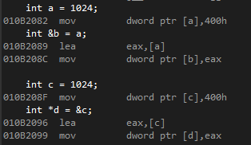
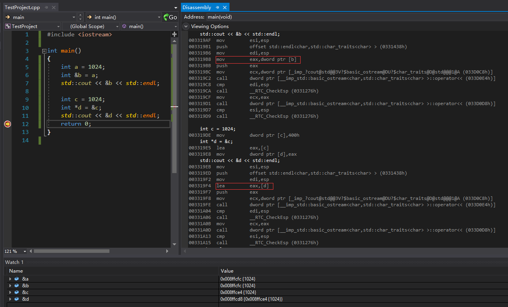

测试环境：Visual Studio 2017

## 概念

我们日常说的引用，通常指的是左值引用（右值引用请参考C++ primer 5th）。引用为对象起了另外一个名字，引用类型引用另外一种类型（来源：C++ primer 5th p45）。

代码如下：

```c++
int a = 1024; 
int &b = a;   //b指向a，b引用a	
int &c;       //报错，引用必须被初始化
std::cout << a << std::endl;	//输出 1024
std::cout << b << std::endl;   	//输出 1024，b是a的别名
int e = 1;
b = e;							// b:1  a:1， b是别名，所以对b赋值也即对a赋值
```

## 底层实现

一般在初始化变量时，初始值会被拷贝到新建的对象中。然而定义引用时，程序把引用和它的初始值绑定在一起，而不是将初始值拷贝给引用（来源：C++ primer 5th p46）。

### 与原变量绑定

```
用到的汇编指令：
mov（移动地址中的值）：mov dest,src 将src数据传送到dest
lea（取有效地址指令）：lea eax,orpd 将orpd的值赋值给eax（地址）
```

（vs debug模式，鼠标右键，选择Dissassembly查看反汇编代码。）

首先来看一段指针和引用的汇编代码：


我们都知道指针和引用的概念是不一样的，但是指针和引用的汇编代码竟然是一样的！

接下来，解释一下引用的汇编代码：（dword（即double word）：每个word为2个字节）

```
	int a = 1024;
00882082  mov         dword ptr [a],400h  	// 申请一个4字节的内存，把1024的二进制值传送给[a]
	int &b = a;
00882089  lea         eax,[a]  				// 将a地址的值赋值给eax
0088208C  mov         dword ptr [b],eax		// 将eax的值（也就是a地址的值）赋值给b
```

通过上面的解释，我们可以知道，变量b实际上存放的就是a的地址。由上，我们也可以知道sizeof(引用)和sizeof(原变量)是一样的，都是原变量地址的大小。

但是上面的总结是从汇编代码的角度上来说的。编译程序有四个阶段，分别为预处理、编译、汇编、链接，编译过程就是把预处理完的文件进行一系列词法分析、语法分析、语义分析及优化后生产相应的汇编代码文件，所以我们看到的汇编代码，其实是编译器优化之后产生的代码（ps：这些相关内容，可以查看《程序员的自我修养——链接、装载与库》第2章）。所以汇编结果和概念并不冲突，编译器怎么优化、怎么编译其实是编译规则，是由编译器决定的。指针和引用依然是两个概念。

接下来我们来看一下，引用和指针内存地址里的内容。



从上图，我们可以看到，&b和&a的结果是一样的；指针d自己有内存空间，且在该空间里存储的是c的地址。

然后看看右边的汇编代码，会发现有一处不同。（这个地方需要理解下mov和lea的区别，这里推荐一个回答，讲得很好：[汇编语言中mov和lea的区别有哪些？]( https://www.zhihu.com/question/40720890/answer/110774673)）

- 第一个框框里的内容是`mov  eax,dword ptr [b] `，指的是将[b]内存里的数据赋值给eax。在之前已经说过变量b实际上存放的就是a的地址，所以该条指令也就是把a的地址传送到eax。所以，&b取的b这块内存里的数据（即引用a的地址值）。
- 第二个框框里的内容是`lea  eax,[d]  `，指的是将[d]这块内存地址直接赋值给eax（不是内存地址里的数据）。所以，&d就是d所在的那一块地址的值。

总结：对编译器来说，&b和&d不是一回事儿，&b和d才是一回事儿。&b被编译器优化过啦。所以，引用是被抽象出来的概念，各种优化由编译器决定。

### 引用占内存吗？

因为汇编代码是一样的，使用引用就像使用变量本身一样，所以直接使用sizeof是得不到引用本身的大小的。

使用只含有引用的类，然后测试类的大小，可以得出引用和指针一样占相同空间的结论。

代码示例：（来源：[C++ 引用占用内存？（转）](https://zhuanlan.zhihu.com/p/78800232)）

```C++
class refClass{ 
private: 
  double& ref; 
public: 
refClass(double var = 42.0) :ref(var){} 
};

std::cout << sizeof refClass << std::endl;  // print 4
```

### 只可被绑定一次

一旦初始化完成，引用将和它的初始值对象一直绑定在一起。因为无法令引用重新绑定到另外一个对象，因此引用必须被初始化。（来源：C++ primer 5th p46）

上面的汇编代码中指针和引用是一样的，所以引用其实更像是一个指针常量（是一个常量，但是类型是指针类型）。这个也是编译器设置的。

## 使用场景

一旦代表了该对象就不能够改变（永久绑定）。（来源：《More Effective C++》条款1）

实现一个操作符而其语法需求无法由指针达成。（来源：《More Effective C++》条款1）

函数参数，很多时候也是用的std::string& name或const std::string& name。

遍历一些容器，很多时候也是用的引用，这也是为了减少构造。

（ps：引用存放的是原变量的地址；而传值会调用构造函数，调用构造函数的成本是比较大的。函数传值和传指针的汇编代码也是一样的。）

## 引用和指针的区别

《More Effective C++》条款1介绍了两者的区别。

- **初始化：**引用必须要被初始化，指针没有这个限制。所以当一个变量其目的是用来指向（代表）另一个对象，但是这个变量也可能不指向（代表）任何对象，这个时候应该使用指针。
- **有效性：**由于引用必须被初始化，所以引用在使用的时候不需要测试其有效性；但是指针通常需要判空，如果不判空，在使用起来不安全。
- **重新赋值：**指针可以被重新赋值，但是引用却总是指向（代表）它最初获得的那个对象，不会改变。

其他方面总结：（来源于网络）

- **多级：**指针有多级。引用只能是一级。
- **自增：**指针自增是对内存地址的自增。引用自增是对值的自增。（也是可以查看汇编代码验证。）

## 总结：

引用和指针声明定义的汇编代码是一样的，但是在使用的时候，编译器会做优化，有时候的汇编代码是不一样的，所以表现不一样。引用更像抽象出来的概念，包括必须初始化、永久绑定等，其实都是编译器做的一些优化。但是，深刻理解引用会让我们写代码的时候，不容易犯错。
