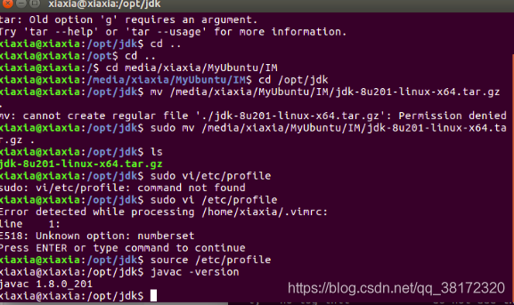
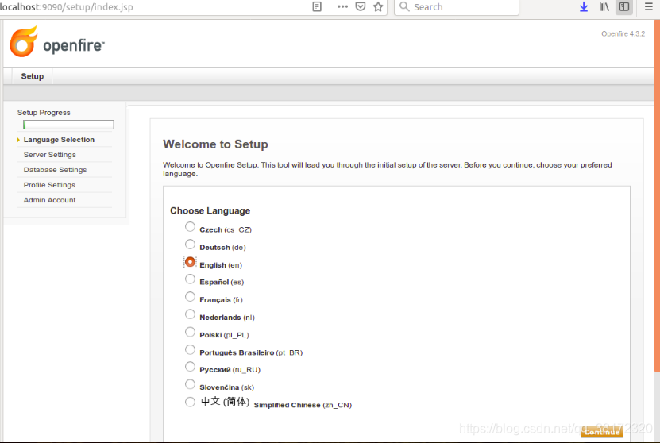
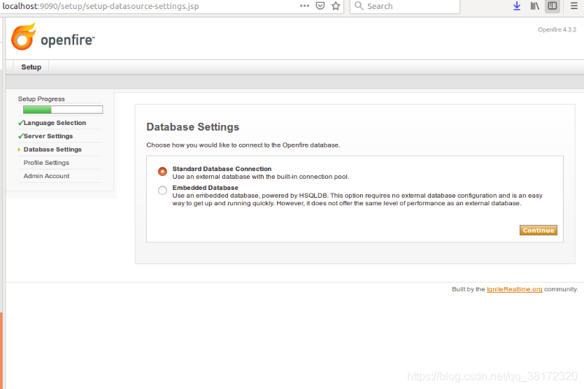
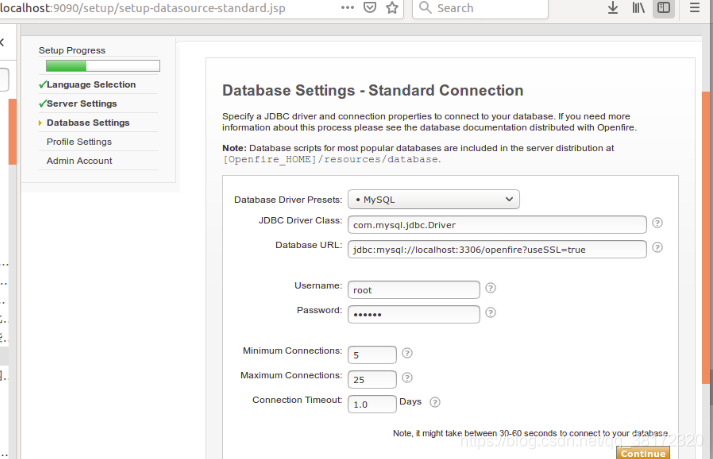
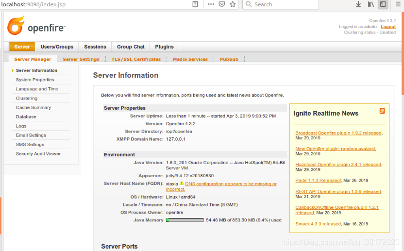
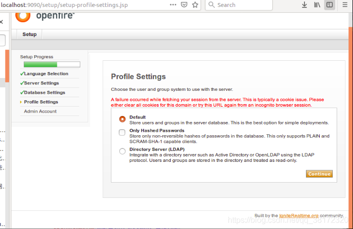

# spark登录openfire 配置安装及运行

## 安装环境：
ubuntu 16.04 LTS：部署openfire
windows 7 ultimate：安装spark

## 安装前的准备工作
- 安装jdk
1、下载地址：
https://www.oracle.com/technetwork/java/javase/downloads/jdk8-downloads-2133151.html
选择Linux x64	182.93 MB  	jdk-8u201-linux-x64.tar.gz
2、创建保存java的目录：
sudo mkdir /opt/jdk
3、把下载的文件放到第2步创建的jdk目录下：
cd /opt/jdk
sudo mv /media/xiaxia/MyUbuntu/IM/jdk-8u201-linux-x64.tar.gz
注：mv后面是下载文件的保存路径
4、解压：
tar jdk-8u201-linux-x64.tar.gz
5、修改环境变量文件：
sudo gedit /etc/profile
6、在环境变量后面加上：
export JAVA_HOME=/opt/jdk/jdk1.8.0_201
export JRE_HOME=${JAVA_HOME}/jre
export CLASSPATH=.:{JAVA_HOME}/lib:${JRE_HOME}/lib
export PATH=$PATH:${JAVA_HOME}/bin:${JRE_HOME}/bin
注：第一个JAVA_HOME是jdk存放路径，其他不变
7、让环境变量生效：
source /etc/profile
8、确保安装成功：
javac -version
注：显示版本信息则安装成功。
 

- 安装mysql
1、分别执行下面三条命令：
sudo apt-get install mysql-server
sudo apt install mysql-client
sudo apt install libmysqlclient-dev
注：系统将提示你在安装过程中创建root密码，记住自己的密码，会用到。
2、测试是否安装成功：
sudo netstat -tap | grep mysql
显示信息则安装成功
3、启动mysql：
sudo service mysql start
4、登录mysql（root为登录名）：
sudo mysql -u root -p
输入密码

## 安装openfire
1、下载地址：选择合适版本下载。
https://www.igniterealtime.org/downloads/index.jsp
2、创建保存openfire的目录：
sudo mkdir /opt/openfire
3、把下载的文件放到第2步创建的openfire目录下：
cd /opt/openfire
sudo mv /media/xiaxia/MyUbuntu/IM/openfire_4_3_2.tar.gz
4、解压：
tar openfire_4_3_2.tar.gz
5、修改环境变量文件：
sudo gedit /etc/profile
6、创建一个openfire组：
sudo groupadd openfire
7、添加一个用户并将该用户加入到openfire组：
sudo useradd -d /opt/openfire -g openfire openfire
8、更改/opt/openfire的属主和属组：
sudo chown -R openfire:openfire /opt/openfire
9、执行openfire：
sudo su - openfire
或：
cd /opt/openfire/bin
./openfire start
## 配置
- 配置数据库：
1、进入openfire数据库脚本所在目录：
cd /opt/openfire/resources/database/
ls（显示有这样一条：openfire mysql.sql）
2、登录mysql：
mysql -u root -p
3、创建openfire数据库（在第二步完成后的shell里面执行）：
create database openfire;
4、切换到openfire数据库：
use openfire;
5、导入数据库脚本：
source /opt/openfire/resources/database/openfire_mysql.sql
6、刷新权限：
flush privileges;

- 配置openfire
1、在浏览器中输入http://localhost:9090/进入配置界面：
前提：mysql、openfire均已打开
2、选择语言：
 
3、Server Settings：
XMPP域名：建议申请域名，设置为申请的域名，或者使用127.0.0.1；
Server Host Name（FQDN）：自己设置；
Property Encryption via：选择AES，默认选择Blowfish在Profile Setting这步会出错；
Property Encryption Key：自己设置。
 
4、Database Settings：
默认选择标准数据库连接即可
 
5、输入mysql的连接信息：
JDBC Driver Class：com.mysql.jdbc.Driver
Database URL：jdbc:mysql://localhost:3306/openfire?useSSL=true
Username与Password是mysql数据库用户名和密码
 
6、Profile Settings：
默认设置
7、Administrator Account：
自己设置
8、安装完毕：
9、进入登录界面：
初始用户名密码均为admin
10、登录成功界面：
 
11、新建用户：
Users/Groups->Create New User->设置用户名

## 安装spark
1、使用ubuntu 16.04查看ip 地址（即服务器）：
ifconfig -a
控制台输出：lo下面：
inet addr:127.0.0.1  Mask:255.0.0.0
wlp3s0下面：
inet addr:192.168.1.109  Bcast:192.168.1.255  Mask:255.255.255.0
ip地址即为192.168.1.109
2、下载地址和openfire下载地址一样：
3、在windows上安装spark，一路默认即可：
4、域名则填写我们服务器的域名，即192.168.1.109
使用用户名和密码登录。

遇到的部分错误：
1、Profile Settings:
A failure occurred while fetching your session from the server.....如图：
 
原因是Server Setting 把Property Encryption via设置成了Blowfish。